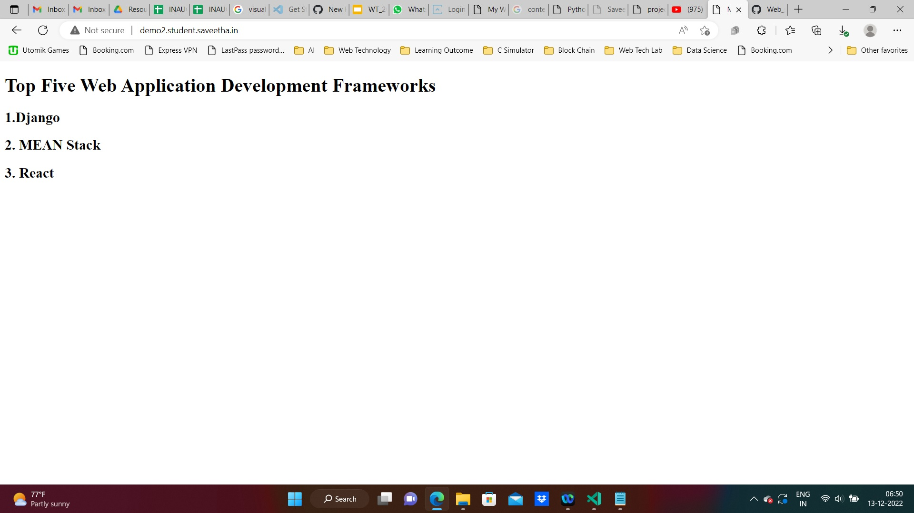

# Ex-01-Simple-Web-Server
###### Name: Krithick Vivekananda 
###### Ref.No: 23009445
## Date:11/11/23


## AIM:
To develop a simple webserver to serve html pages.

## DESIGN STEPS:
### Step 1: 
HTML content creation.

### Step 2:
Design of webserver workflow.

### Step 3:
Implementation using Python code.

from http.server import HTTPServer,BaseHTTPRequestHandler

content= """
<html>
<head>
</head>
<body>
<h1>Top Three Web Application Develpoment Frameworks </h1>
<h3>1.Django</h3>
<h3>2.MEAN Stack</h3>
<h3>3.React</h3>
</body>
</html>
"""

class HelloHandler(BaseHTTPRequestHandler):
    def do_GET(self):
        self.send_response(200)
        self.send_header("Content-type","text/html; charset=utf-8")
        self.end_headers()
        self.wfile.write(content.encode())

server_address = ('',80)
httpd=HTTPServer(server_address,HelloHandler)
httpd.serve_forever()


### Step 4:
Serving the HTML pages.

### Step 5:
Testing the webserver.

## PROGRAM:
```python
from http.server import HTTPServer,BaseHTTPRequestHandler

content= """
<html>
<head>
</head>
<body>
<h1>Top Three Web Application Develpoment Frameworks </h1>
<h3>1.Django</h3>
<h3>2.MEAN Stack</h3>
<h3>3.React</h3>
</body>
</html>
"""

class HelloHandler(BaseHTTPRequestHandler):
    def do_GET(self):
        self.send_response(200)
        self.send_header("Content-type","text/html; charset=utf-8")
        self.end_headers()
        self.wfile.write(content.encode())

server_address = ('',80)
httpd=HTTPServer(server_address,HelloHandler)
httpd.serve_forever()

```


## OUTPUT:


## RESULT:
The program for implementing simple webserver is executed successfully.
